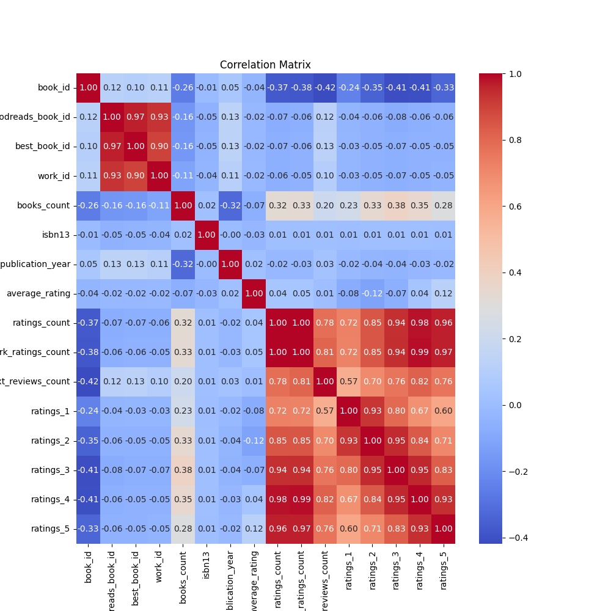
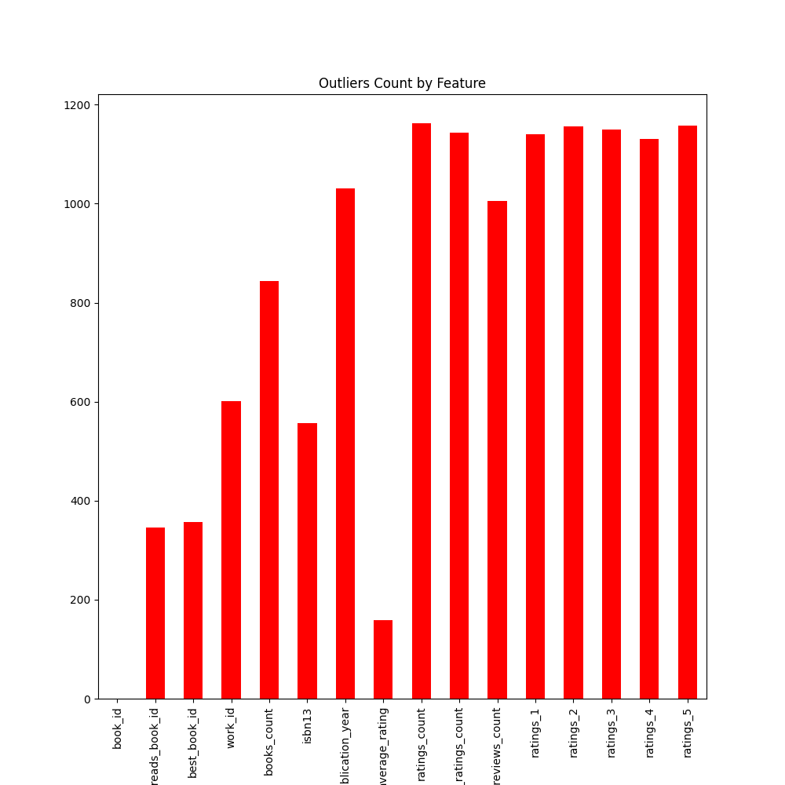
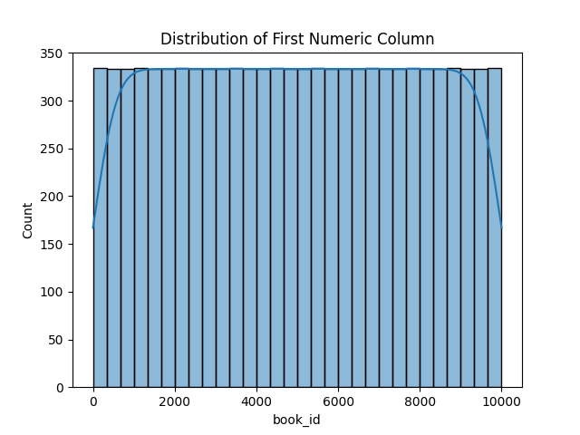

# 🌟 Data Analysis Report 🌟

|        |   book_id |   goodreads_book_id |     best_book_id |         work_id |   books_count |           isbn |         isbn13 | authors      |   original_publication_year | original_title   | title          | language_code   |   average_rating |    ratings_count |   work_ratings_count |   work_text_reviews_count |   ratings_1 |   ratings_2 |   ratings_3 |      ratings_4 |       ratings_5 | image_url                                                                                | small_image_url                                                                        |
|:-------|----------:|--------------------:|-----------------:|----------------:|--------------:|---------------:|---------------:|:-------------|----------------------------:|:-----------------|:---------------|:----------------|-----------------:|-----------------:|---------------------:|--------------------------:|------------:|------------:|------------:|---------------:|----------------:|:-----------------------------------------------------------------------------------------|:---------------------------------------------------------------------------------------|
| count  |  10000    |     10000           |  10000           | 10000           |    10000      | 9300           | 9415           | 10000        |                    9979     | 9415             | 10000          | 8916            |     10000        |  10000           |      10000           |                  10000    |    10000    |    10000    |     10000   | 10000          | 10000           | 10000                                                                                    | 10000                                                                                  |
| unique |    nan    |       nan           |    nan           |   nan           |      nan      | 9300           |  nan           | 4664         |                     nan     | 9274             | 9964           | 25              |       nan        |    nan           |        nan           |                    nan    |      nan    |      nan    |       nan   |   nan          |   nan           | 6669                                                                                     | 6669                                                                                   |
| top    |    nan    |       nan           |    nan           |   nan           |      nan      |    4.39023e+08 |  nan           | Stephen King |                     nan     |                  | Selected Poems | eng             |       nan        |    nan           |        nan           |                    nan    |      nan    |      nan    |       nan   |   nan          |   nan           | https://s.gr-assets.com/assets/nophoto/book/111x148-bcc042a9c91a29c1d680899eff700a03.png | https://s.gr-assets.com/assets/nophoto/book/50x75-a91bf249278a81aabab721ef782c4a74.png |
| freq   |    nan    |       nan           |    nan           |   nan           |      nan      |    1           |  nan           | 60           |                     nan     | 5                | 4              | 6341            |       nan        |    nan           |        nan           |                    nan    |      nan    |      nan    |       nan   |   nan          |   nan           | 3332                                                                                     | 3332                                                                                   |
| mean   |   5000.5  |         5.2647e+06  |      5.47121e+06 |     8.64618e+06 |       75.7127 |  nan           |    9.75504e+12 | nan          |                    1981.99  | nan              | nan            | nan             |         4.00219  |  54001.2         |      59687.3         |                   2919.96 |     1345.04 |     3110.89 |     11475.9 | 19965.7        | 23789.8         | nan                                                                                      | nan                                                                                    |
| std    |   2886.9  |         7.57546e+06 |      7.82733e+06 |     1.17511e+07 |      170.471  |  nan           |    4.42862e+11 | nan          |                     152.577 | nan              | nan            | nan             |         0.254427 | 157370           |     167804           |                   6124.38 |     6635.63 |     9717.12 |     28546.4 | 51447.4        | 79768.9         | nan                                                                                      | nan                                                                                    |
| min    |      1    |         1           |      1           |    87           |        1      |  nan           |    1.9517e+08  | nan          |                   -1750     | nan              | nan            | nan             |         2.47     |   2716           |       5510           |                      3    |       11    |       30    |       323   |   750          |   754           | nan                                                                                      | nan                                                                                    |
| 25%    |   2500.75 |     46275.8         |  47911.8         |     1.00884e+06 |       23      |  nan           |    9.78032e+12 | nan          |                    1990     | nan              | nan            | nan             |         3.85     |  13568.8         |      15438.8         |                    694    |      196    |      656    |      3112   |  5405.75       |  5334           | nan                                                                                      | nan                                                                                    |
| 50%    |   5000.5  |    394966           | 425124           |     2.71952e+06 |       40      |  nan           |    9.78045e+12 | nan          |                    2004     | nan              | nan            | nan             |         4.02     |  21155.5         |      23832.5         |                   1402    |      391    |     1163    |      4894   |  8269.5        |  8836           | nan                                                                                      | nan                                                                                    |
| 75%    |   7500.25 |         9.38223e+06 |      9.63611e+06 |     1.45177e+07 |       67      |  nan           |    9.78083e+12 | nan          |                    2011     | nan              | nan            | nan             |         4.18     |  41053.5         |      45915           |                   2744.25 |      885    |     2353.25 |      9287   | 16023.5        | 17304.5         | nan                                                                                      | nan                                                                                    |
| max    |  10000    |         3.32886e+07 |      3.55342e+07 |     5.63996e+07 |     3455      |  nan           |    9.79001e+12 | nan          |                    2017     | nan              | nan            | nan             |         4.82     |      4.78065e+06 |          4.94236e+06 |                 155254    |   456191    |   436802    |    793319   |     1.4813e+06 |     3.01154e+06 | nan                                                                                      | nan                                                                                    |

## 🔍 Missing Values
Unveiling the gaps in our dataset, below are the missing value counts for each column:

| Column                    |   Missing Values |
|:--------------------------|-----------------:|
| book_id                   |                0 |
| goodreads_book_id         |                0 |
| best_book_id              |                0 |
| work_id                   |                0 |
| books_count               |                0 |
| isbn                      |              700 |
| isbn13                    |              585 |
| authors                   |                0 |
| original_publication_year |               21 |
| original_title            |              585 |
| title                     |                0 |
| language_code             |             1084 |
| average_rating            |                0 |
| ratings_count             |                0 |
| work_ratings_count        |                0 |
| work_text_reviews_count   |                0 |
| ratings_1                 |                0 |
| ratings_2                 |                0 |
| ratings_3                 |                0 |
| ratings_4                 |                0 |
| ratings_5                 |                0 |
| image_url                 |                0 |
| small_image_url           |                0 |

## 🎨 Visualizations
Visual insights into our data:

### Correlation Heatmap

### Outliers Detected

### Data Distribution

## ✨ Story
Step into a narrative journey inspired by the dataset:

### The World of Books: Insights from a Data-Driven Exploration

In a world brimming with stories, characters, and ideas, books have long served as portals to different realms of thought and imagination. Whether nestled in a cozy armchair or carried in a backpack, each book offers a unique journey for its reader. The significance of analyzing book data is profound, providing insights into trends, reader preferences, and the literary landscape as a whole. This narrative delves into a treasure trove of data from 10,000 books, unveiling intriguing patterns and key takeaways that illuminate our understanding of literature's impact in the modern age.

As we embark on this analytical journey, the first revelation arises from the **average ratings** of books in our dataset. With a mean rating of **4.00**, it’s evident that readers generally hold these works in high regard. This positivity reflects not only the quality of the books but also the engagement of the reading community. The data shows a remarkable **standard deviation of 0.25**, indicating a consistent appreciation across the board, with ratings ranging from **2.47** to a high of **4.82**. This insight suggests that while there are standout titles, most books resonate well with their audience, making them worthy of exploration.

Diving deeper, the analysis reveals the distribution of **ratings counts** among these books, with an average of **54,001** ratings per book. This robust engagement demonstrates a vibrant community of readers actively sharing their thoughts. Notably, some books have garnered attention from as many as **4,780,653** readers, highlighting the power of word-of-mouth and social media in influencing reading choices. This suggests that a strong online presence can significantly elevate a book's visibility and readership, making it essential for both authors and publishers to harness digital platforms effectively.

Furthermore, the dataset shines a light on the authors behind these literary works, with a total of **4,664 unique authors** contributing to the collection. Among them, **Stephen King** stands out, with **60 works** represented. This prevalence underscores King's enduring popularity and the powerful connection he has forged with readers. The diversity of authors also indicates a rich tapestry of voices and narratives, inviting readers from various backgrounds to find their place within the literary community.

Looking at the **original publication years** of the books, we find an average year of **1981**, with a range spanning from as far back as **-1750** to **2017**. This temporal breadth reflects the timeless nature of storytelling, as classics continue to captivate new generations while contemporary works push the boundaries of genre and style. Such diversity allows readers to engage with various perspectives, fostering a deeper understanding of cultural and historical contexts through literature.

Additionally, the analysis highlights the **language** of the books, predominantly in **English**, which makes up **71%** of the dataset. This raises important considerations about accessibility and representation in literature. While English works dominate, the inclusion of **25 unique languages** invites readers from different linguistic backgrounds to engage with stories in their native tongues, emphasizing the importance of translation and localization in a globalized world.

In conclusion, the exploration of this book data not only offers a glimpse into the preferences and behaviors of readers but also emphasizes the dynamic relationship between literature and its audience. With high average ratings and robust engagement metrics, it is clear that readers are eager to connect with quality stories. As the literary landscape continues to evolve, authors and publishers must remain attentive to these insights, leveraging data to enhance their strategies and foster a deeper connection with readers. By understanding the trends and preferences highlighted in this analysis, we can celebrate the rich diversity of voices in literature and ensure that stories continue to resonate for generations to come.
## 📘 Conclusion
Through this report, we unravel the patterns and anomalies present in the dataset. From statistical revelations to visual storytelling, each element contributes to a deeper understanding of the data at hand.
