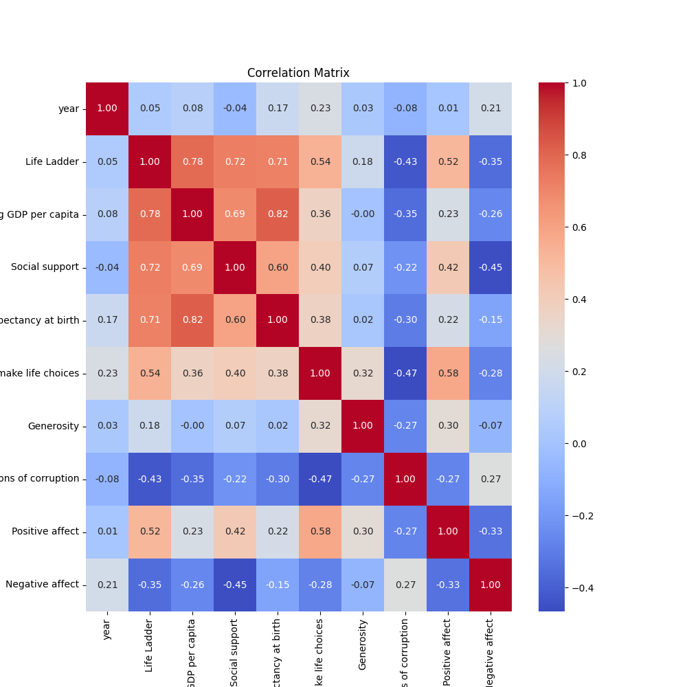
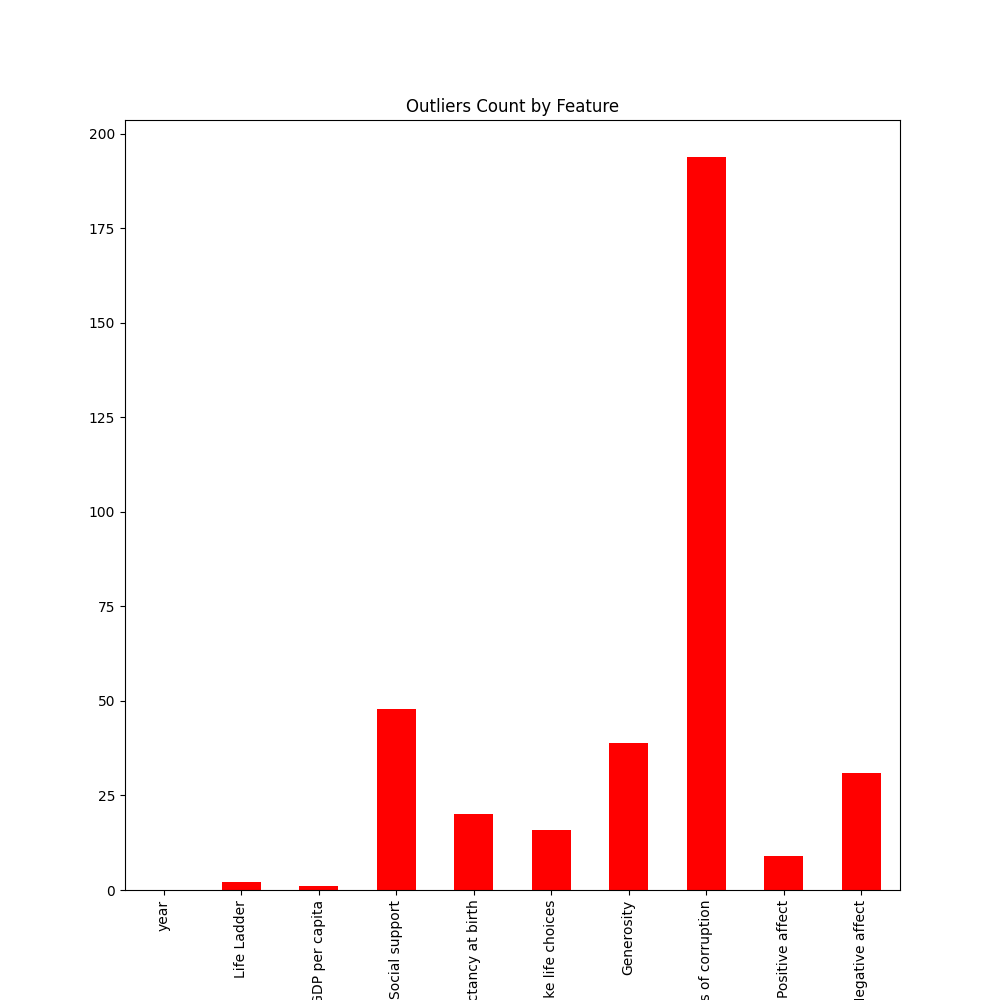
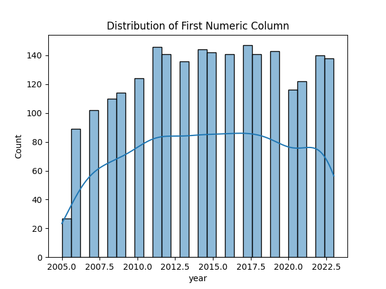

# 🌟 Data Analysis Report 🌟

|        | Country name   |       year |   Life Ladder |   Log GDP per capita |   Social support |   Healthy life expectancy at birth |   Freedom to make life choices |     Generosity |   Perceptions of corruption |   Positive affect |   Negative affect |
|:-------|:---------------|-----------:|--------------:|---------------------:|-----------------:|-----------------------------------:|-------------------------------:|---------------:|----------------------------:|------------------:|------------------:|
| count  | 2363           | 2363       |    2363       |           2335       |      2350        |                         2300       |                    2327        | 2282           |                 2238        |       2339        |      2347         |
| unique | 165            |  nan       |     nan       |            nan       |       nan        |                          nan       |                     nan        |  nan           |                  nan        |        nan        |       nan         |
| top    | Lebanon        |  nan       |     nan       |            nan       |       nan        |                          nan       |                     nan        |  nan           |                  nan        |        nan        |       nan         |
| freq   | 18             |  nan       |     nan       |            nan       |       nan        |                          nan       |                     nan        |  nan           |                  nan        |        nan        |       nan         |
| mean   | nan            | 2014.76    |       5.48357 |              9.39967 |         0.809369 |                           63.4018  |                       0.750282 |    9.77213e-05 |                    0.743971 |          0.651882 |         0.273151  |
| std    | nan            |    5.05944 |       1.12552 |              1.15207 |         0.121212 |                            6.84264 |                       0.139357 |    0.161388    |                    0.184865 |          0.10624  |         0.0871311 |
| min    | nan            | 2005       |       1.281   |              5.527   |         0.228    |                            6.72    |                       0.228    |   -0.34        |                    0.035    |          0.179    |         0.083     |
| 25%    | nan            | 2011       |       4.647   |              8.5065  |         0.744    |                           59.195   |                       0.661    |   -0.112       |                    0.687    |          0.572    |         0.209     |
| 50%    | nan            | 2015       |       5.449   |              9.503   |         0.8345   |                           65.1     |                       0.771    |   -0.022       |                    0.7985   |          0.663    |         0.262     |
| 75%    | nan            | 2019       |       6.3235  |             10.3925  |         0.904    |                           68.5525  |                       0.862    |    0.09375     |                    0.86775  |          0.737    |         0.326     |
| max    | nan            | 2023       |       8.019   |             11.676   |         0.987    |                           74.6     |                       0.985    |    0.7         |                    0.983    |          0.884    |         0.705     |

## 🔍 Missing Values
Unveiling the gaps in our dataset, below are the missing value counts for each column:

| Column                           |   Missing Values |
|:---------------------------------|-----------------:|
| Country name                     |                0 |
| year                             |                0 |
| Life Ladder                      |                0 |
| Log GDP per capita               |               28 |
| Social support                   |               13 |
| Healthy life expectancy at birth |               63 |
| Freedom to make life choices     |               36 |
| Generosity                       |               81 |
| Perceptions of corruption        |              125 |
| Positive affect                  |               24 |
| Negative affect                  |               16 |

## 🎨 Visualizations
Visual insights into our data:

### Correlation Heatmap

### Outliers Detected

### Data Distribution

## ✨ Story
Step into a narrative journey inspired by the dataset:

### The Pursuit of Happiness: Insights from Global Data

In an increasingly interconnected world, understanding the nuances of human well-being across different nations is more crucial than ever. The recent analysis of various factors influencing life satisfaction sheds light on how countries measure up in terms of happiness, social support, economic stability, and overall quality of life. This story aims to explore the significant data points that reveal not just numbers, but the very essence of what makes life fulfilling for individuals around the globe.

The analysis reveals that Lebanon stands out as the most frequently mentioned country, with a notable count of 2363 data entries. This number signifies a rich tapestry of experiences and sentiments that have been documented over time. The data spans from 2005 to 2023, with an average year of approximately 2014. This temporal range allows us to observe shifts in happiness and well-being, reflecting changes in societal dynamics, political climates, and economic conditions. The overall mean "Life Ladder" score—5.48—indicates that, on average, individuals in these countries report being moderately satisfied with their lives. However, this average masks a wide spectrum of experiences, with scores ranging from a low of 1.28 to a high of 8.02, underscoring the disparities in well-being across different regions.

Diving deeper into the data, we find that economic factors play a significant role in shaping life satisfaction. The average "Log GDP per capita" stands at 9.40, with a maximum of 11.68, indicating that wealthier nations tend to provide better living conditions and opportunities for their citizens. Yet, wealth alone does not guarantee happiness. The "Social Support" metric, averaging 0.81, highlights the importance of community and interpersonal relationships in enhancing individual well-being. In fact, the data shows that countries with strong social networks tend to score higher on the Life Ladder, suggesting that emotional support and connection are critical components of a fulfilling life.

Another vital element captured in the analysis is the "Freedom to make life choices," which averages at 0.75. This statistic emphasizes the significance of autonomy in contributing to happiness. The data reveals that individuals who feel empowered to make personal choices report higher satisfaction levels. This finding resonates with the understanding that freedom and personal agency are fundamental to human flourishing, making it essential for policymakers to foster environments that promote individual liberties.

As we look at perceptions of corruption, the average score of 0.74 indicates a widespread awareness of governance issues that can undermine trust and happiness. Countries with lower perceptions of corruption often correlate with higher life satisfaction scores, reinforcing the idea that transparent and accountable governance is pivotal for societal well-being. Furthermore, the analysis of "Positive Affect," averaging at 0.65, suggests that individuals generally experience more positive emotions than negative ones, which is encouraging. However, the average "Negative Affect" score of 0.27 reveals that while positivity prevails, there remains a tangible undercurrent of distress that countries must address.

In conclusion, the data paints a complex yet enlightening picture of global happiness and well-being. It underscores the multifaceted nature of life satisfaction, highlighting the interplay between economic stability, social support, personal freedom, and governance. As nations strive to enhance the quality of life for their citizens, it is essential to cultivate environments that empower individuals, foster community ties, and ensure transparent governance. By focusing on these key areas, we can work towards a future where happiness is not just a fleeting sentiment but a fundamental right for all.
## 📘 Conclusion
Through this report, we unravel the patterns and anomalies present in the dataset. From statistical revelations to visual storytelling, each element contributes to a deeper understanding of the data at hand.
