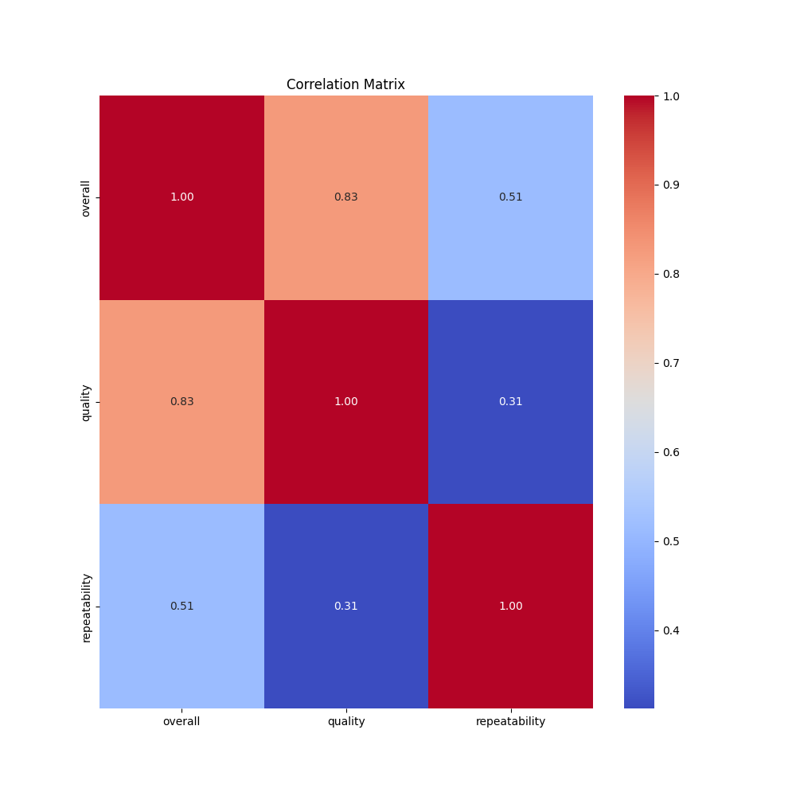
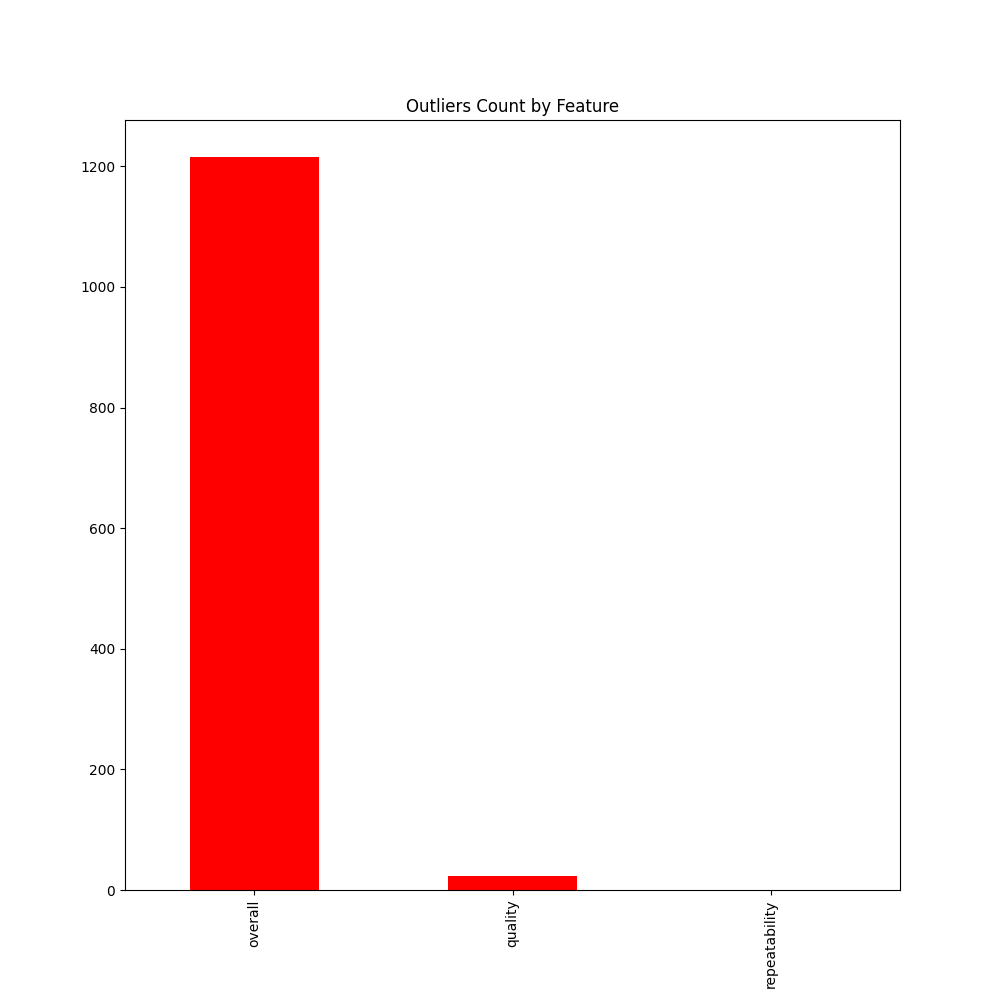
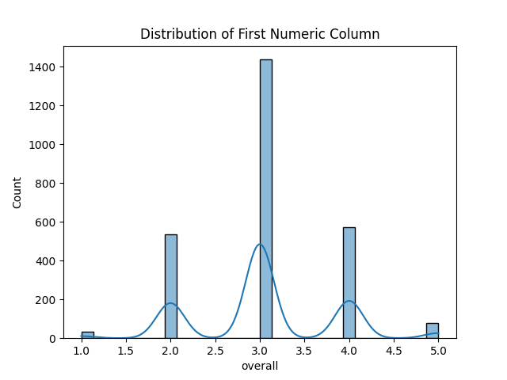

# 🌟 Data Analysis Report 🌟

|        | date      | language   | type   | title             | by                |    overall |     quality |   repeatability |
|:-------|:----------|:-----------|:-------|:------------------|:------------------|-----------:|------------:|----------------:|
| count  | 2553      | 2652       | 2652   | 2652              | 2390              | 2652       | 2652        |     2652        |
| unique | 2055      | 11         | 8      | 2312              | 1528              |  nan       |  nan        |      nan        |
| top    | 21-May-06 | English    | movie  | Kanda Naal Mudhal | Kiefer Sutherland |  nan       |  nan        |      nan        |
| freq   | 8         | 1306       | 2211   | 9                 | 48                |  nan       |  nan        |      nan        |
| mean   | nan       | nan        | nan    | nan               | nan               |    3.04751 |    3.20928  |        1.49472  |
| std    | nan       | nan        | nan    | nan               | nan               |    0.76218 |    0.796743 |        0.598289 |
| min    | nan       | nan        | nan    | nan               | nan               |    1       |    1        |        1        |
| 25%    | nan       | nan        | nan    | nan               | nan               |    3       |    3        |        1        |
| 50%    | nan       | nan        | nan    | nan               | nan               |    3       |    3        |        1        |
| 75%    | nan       | nan        | nan    | nan               | nan               |    3       |    4        |        2        |
| max    | nan       | nan        | nan    | nan               | nan               |    5       |    5        |        3        |

## 🔍 Missing Values
Unveiling the gaps in our dataset, below are the missing value counts for each column:

| Column        |   Missing Values |
|:--------------|-----------------:|
| date          |               99 |
| language      |                0 |
| type          |                0 |
| title         |                0 |
| by            |              262 |
| overall       |                0 |
| quality       |                0 |
| repeatability |                0 |

## 🎨 Visualizations
Visual insights into our data:

### Correlation Heatmap

### Outliers Detected

### Data Distribution

## ✨ Story
Step into a narrative journey inspired by the dataset:

**Title: A Cinematic Journey Through Data: Unveiling Patterns in Movie Preferences**

**Introduction: The Significance of Data in Understanding Cinema**

In an age where entertainment choices are vast and diverse, understanding viewer preferences can provide invaluable insights into the film industry. With data analysis at our fingertips, we can unravel the intricacies of audience behavior, preferences, and trends. This narrative explores a fascinating dataset that encompasses over 2,600 entries, revealing a wealth of information about movies watched, the languages they were presented in, the actors involved, and the overall reception. By delving into this analysis, we can uncover patterns that reflect not just individual tastes but also broader cultural dynamics.

**Body: Key Findings and Their Relevance**

The dataset reveals that a total of **2,652 entries** have been cataloged, with an impressive **2,312 unique titles**. Among these titles, the standout film is “Kanda Naal Mudhal,” which has been noted **nine times**. This highlights not only the popularity of this particular movie but also the varied landscape of cinematic offerings that attract viewers. Interestingly, the analysis indicates that the **most frequently watched films** tend to be categorized predominantly as movies, constituting **2,211 entries**, which emphasizes the public's preference for this format over other types of media.

Diving deeper into the linguistic aspects, it’s clear that **English** is the dominant language, accounting for **1,306 entries**. This finding underscores the global influence of English-language films and their accessibility to a wide audience. However, it also invites discussion about the representation of films in other languages, which, while less frequent, contribute to the rich tapestry of global cinema. The data presents **11 unique languages**, suggesting an opportunity to explore and promote non-English films to diversify viewing experiences.

The analysis of the creators behind these films shows that **Kiefer Sutherland** emerges as the most prolific contributor, with **48 credits** to his name. This statistic not only reflects Sutherland’s influence in the film industry but also invites audiences to consider the impact of individual actors and directors on the popularity and reception of films. The interconnectedness of actor presence and viewer engagement is a critical area worth exploring for both filmmakers and marketers.

Another fascinating aspect of the dataset is the evaluation of film quality and viewer satisfaction. On average, films received a rating of **3.21 out of 5** for quality, indicating a generally positive reception among viewers. However, with a standard deviation of **0.80**, the range of opinions suggests that while many films are appreciated, there is room for improvement in the industry. Similarly, the overall enjoyment rating hovers around **3.05**, highlighting a consistent, if not stellar, level of satisfaction. The analysis also reveals that repeat viewing tends to be less common, with a repeatability score averaging around **1.49**. This may imply that while films are enjoyed, they aren’t always deemed worthy of a second viewing, prompting filmmakers to think about what elements make a movie truly memorable.

**Conclusion: Summarizing Insights and Future Directions**

In conclusion, this data analysis paints a vivid picture of the current state of cinema as experienced by viewers. With a strong inclination towards English-language films and a notable preference for movies, the landscape is both rich and ripe for exploration. The popularity of certain titles and the contributions of individual actors provide a glimpse into the factors that drive audience engagement. 

As we look to the future, filmmakers and industry stakeholders might consider leveraging these insights to enhance their offerings. By focusing on diversifying film languages, improving the quality of productions, and creating more memorable viewing experiences, the industry can not only cater to existing preferences but also expand the horizons of cinematic enjoyment. As audiences continue to evolve, so too must the films that aim to captivate their hearts and minds. This journey through data is just the beginning of understanding the captivating world of cinema, inviting further exploration and appreciation of the art form.
## 📘 Conclusion
Through this report, we unravel the patterns and anomalies present in the dataset. From statistical revelations to visual storytelling, each element contributes to a deeper understanding of the data at hand.
